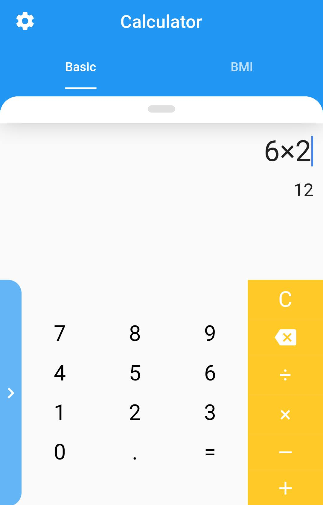
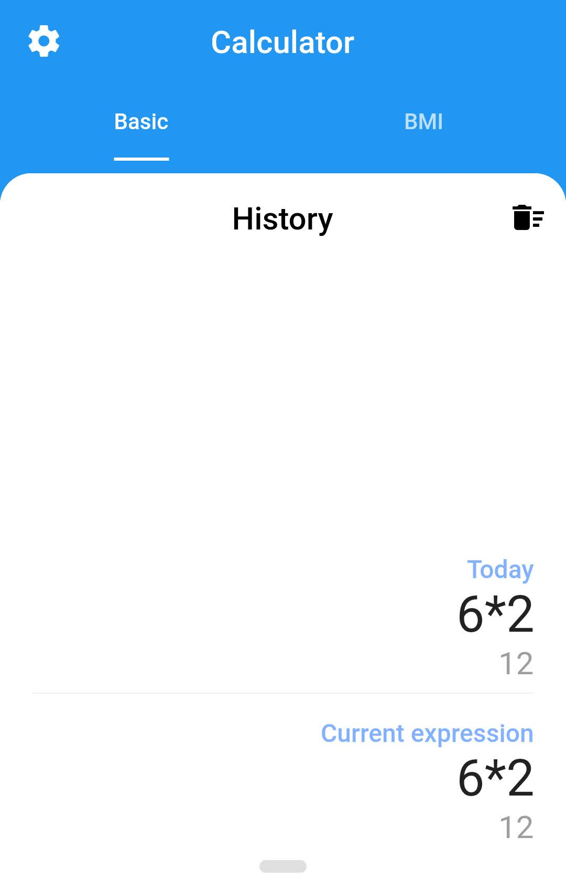
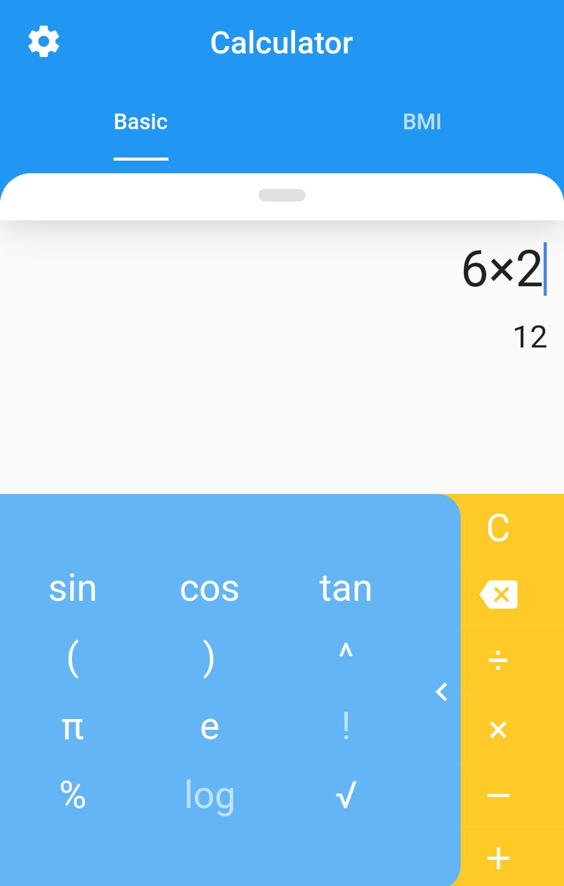
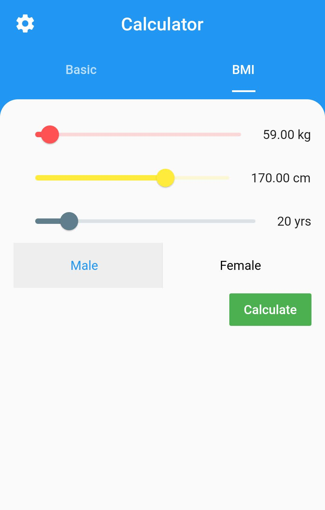
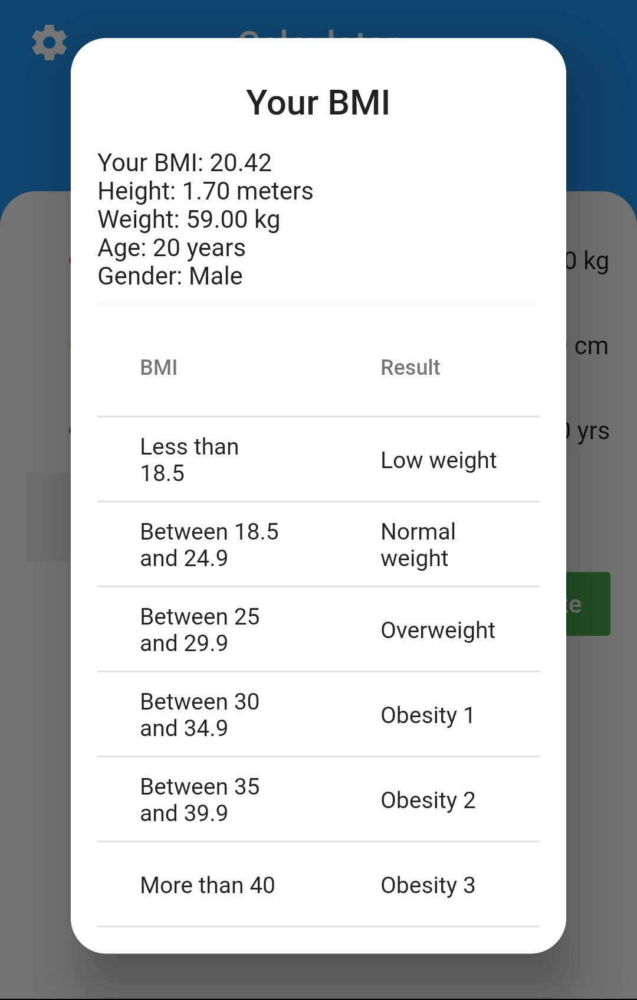
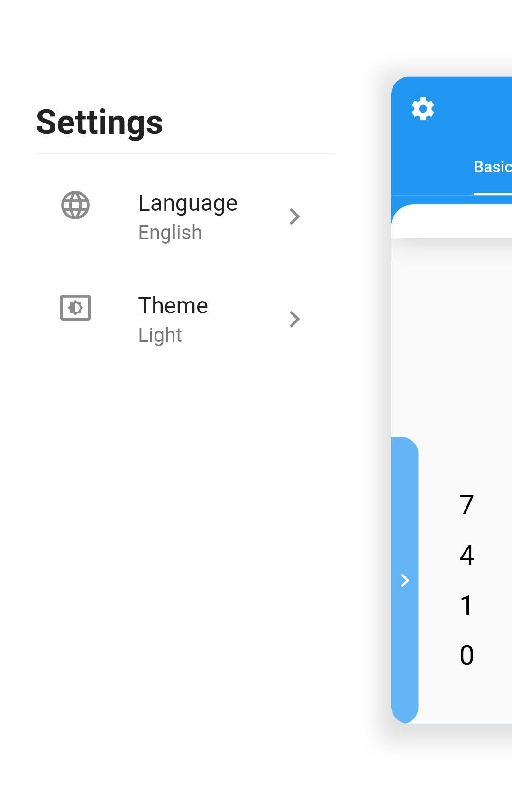
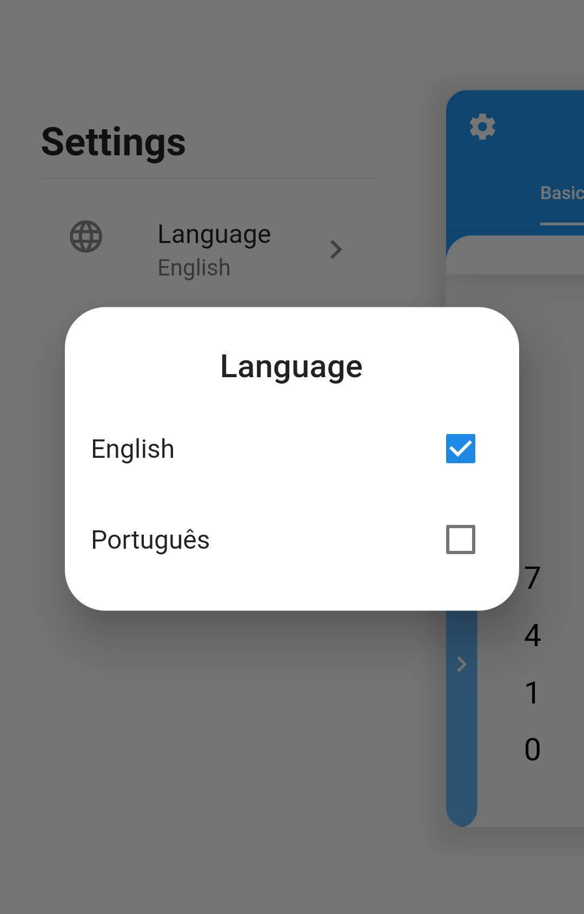
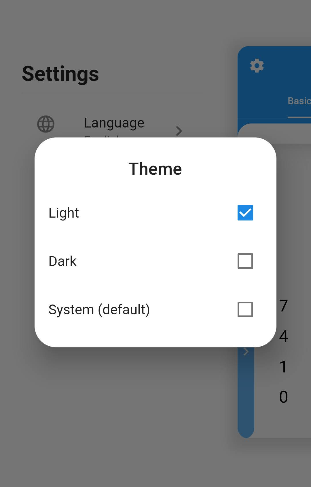
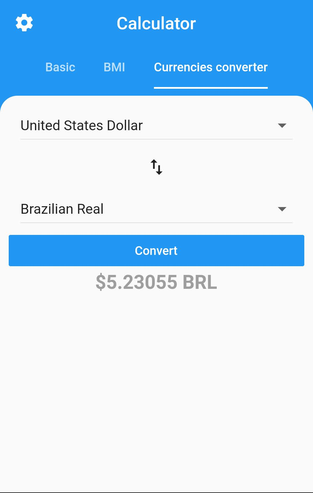
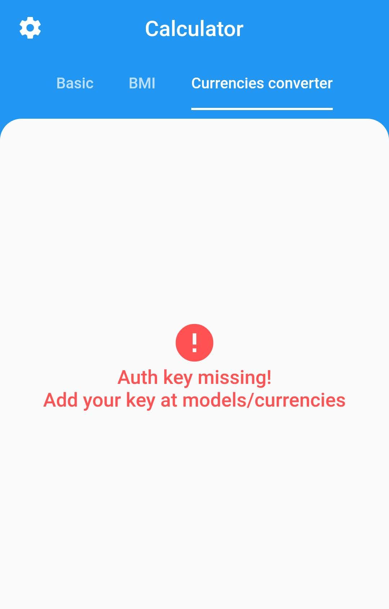

# Calculator

A calculator made in flutter.

## Features

Basic math expressions.
BMI calculation.
Currencies converter.

## Platforms

The app was only tested on Android, but it's supposed to work on Ios and Web too.

## Screenshots

<table>
  <tr>
    <td>Home</td>
     <td>History</td>
     <td>Special</td>
  </tr>
  <tr>
    <td></td>
    <td></td>
    <td></td>
  </tr>
</table>
<table>
  <tr>
    <td>BMI Home</td>
    <td>BMI Result</td>
  </tr>
  <tr>
    <td></td>
    <td></td>
  </tr>
</table>
<table>
  <tr>
    <td>Settings</td>
    <td>Language</td>
    <td>Theme</td>
  </tr>
  <tr>
    <td></td>
    <td></td>
    <td></td>
  </tr>
</table>
<table>
  <tr>
    <td>Currencies converter home</td>
    <td>Currencies converter auth key error</td>
  </tr>
  <tr>
    <td></td>
    <td></td>
  </tr>
</table>

#

Feel free to open an issue if you find an error or make pull requests.
Icon is from google images.